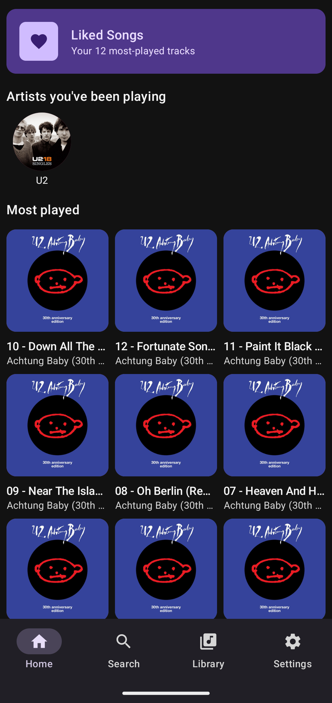
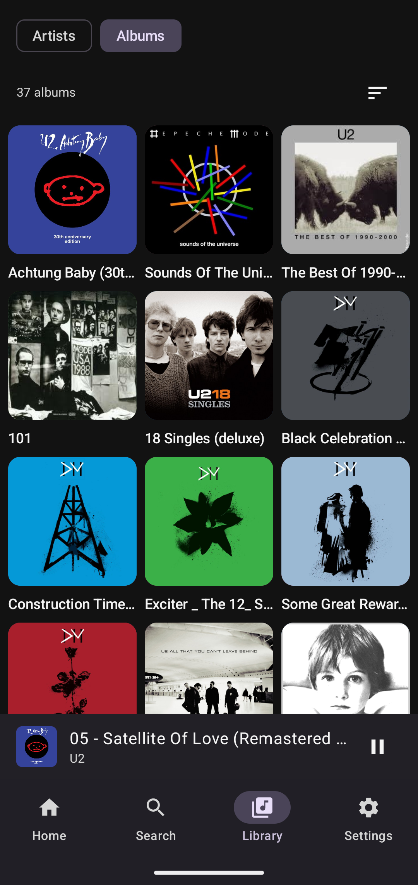
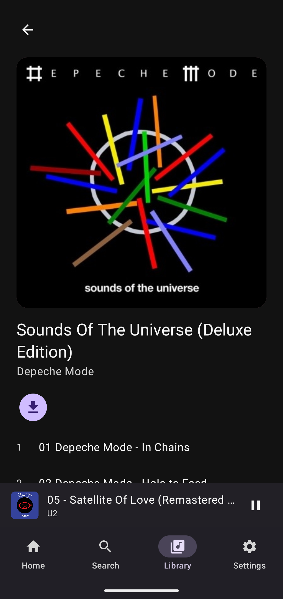
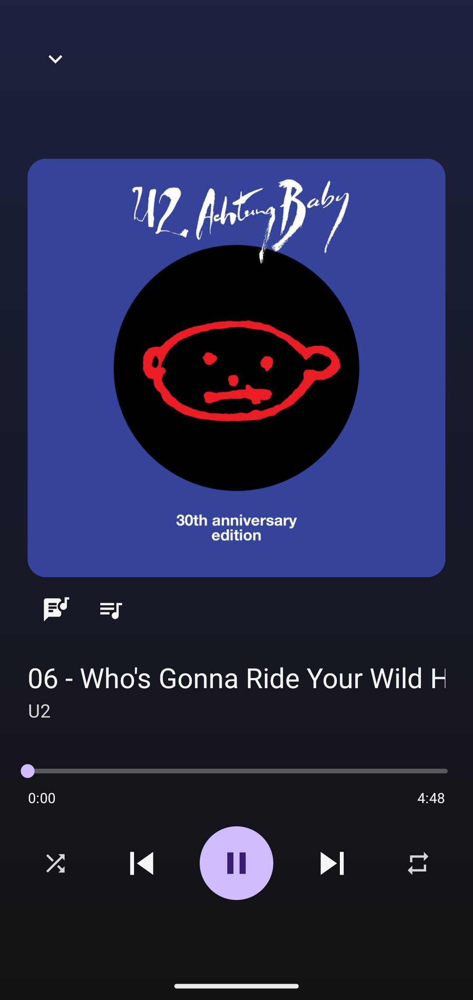
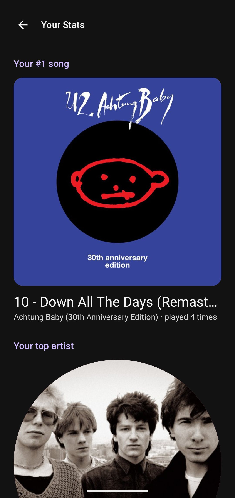

# MusicDrive

**Stream your own music library straight from Google Drive — a
personal, YouTube-Music-style player for Android.**

No re-uploading to a streaming service, no re-encoding, no monthly fee:
point MusicDrive at a Drive folder full of audio files and it turns that
folder into a full-featured music app — background playback, offline
downloads, synced lyrics, and a Material 3 UI, all built around whatever
folder structure your library already uses.

> Personal project, sideloaded — not published to the Play Store.

<p align="center">
  
  
  
  
  
</p>

## Features

- **Your library, your structure** — point it at any Drive folder and it
  finds albums recursively, however your files are organized
  (`Album/`, `Artist/Album/`, multi-disc releases merged automatically).
- **Home dashboard** — your most-played songs and artists, plus an
  auto-generated "Liked Songs" playlist, so the app opens on what you
  actually listen to.
- **Full-text search** across albums, artists, and songs, right from the
  Home screen — no separate search tab to switch to.
- **Real cover art and artist photos**, resolved from embedded tags first
  (covers) or a free online lookup (covers and artist portraits alike),
  cached locally so it's instant after the first look. Slide down on an
  album page to re-check Drive for a newly added song without leaving
  the screen.
- **Mini-player and full-screen player** — swipe down or tap to collapse,
  swipe left/right on the cover to skip, drag the seek bar with the time
  label following your finger, shuffle, 3-state repeat (off/all/one), a
  dominant-color glow pulled live from the current track's artwork.
- **Queue view** — see and jump to any upcoming or previous track.
- **Synced, karaoke-style lyrics** — embedded ID3 tags first, [LRCLIB](https://lrclib.net)
  fallback, word-by-word highlighting as the track plays.
- **"Your Stats"** — a Wrapped-style recap of your top songs and artists.
- **One combined storage limit** in Settings, shared by the streaming cache
  and your explicit per-album downloads. Downloads are never auto-deleted —
  the streaming cache just uses whatever room is left, evicting your
  least-played tracks first. The size picker shows your device's actual
  free space and won't offer a limit bigger than what fits. Settings shows
  exactly what's using space (downloads, streaming cache, album art); a
  Downloads popup lists every downloaded album with per-album and
  remove-all actions.
- **Survives everything** — background playback with a media notification,
  gapless transitions between an album's tracks, and correct recovery even
  if Android kills the app process mid-song.
- Material 3 UI throughout, light/dark/system theme.

**Roadmap:** Android Auto support is next (browsing tree implemented,
pending head-unit testing).

## How it works

- **Library model**: a Drive folder = an album, found by searching down from
  your chosen root for the first folder(s) that directly contain audio files
  — so both `root/Album` and `root/Artist/Album` layouts work. Cached in
  Room so relaunching browses instantly, refreshing quietly in the background.
- **Playback**: Media3/ExoPlayer with two separate caches under one
  user-configurable combined size limit — an auto-managed streaming cache
  (least-played-first eviction) and a permanent cache for explicit
  downloads that are never evicted; the streaming cache's real budget is
  the limit minus whatever downloads are already using. Tuned for fast
  tap-to-audio start, gapless transitions between an album's tracks, and
  survives the OS killing and restarting the app process mid-playback.
- **Auth**: Credential Manager for sign-in, the Identity API's
  `AuthorizationClient` for the separate Drive `drive.readonly` scope
  consent.
- **Lyrics**: embedded ID3 tags first, then LRCLIB's line-synced lyrics
  when available (word-by-word karaoke highlighting is synthesized by
  evenly distributing each line's words across its own timespan, since
  LRCLIB doesn't provide true per-word timing), falling back to plain
  static text when nothing's synced.

For full architecture notes, environment setup, and the detailed
development log, see [CLAUDE.md](CLAUDE.md).

## Building

Requirements: JDK 17, Android SDK (compileSdk 37, AGP 9.3.1).

1. Create an OAuth 2.0 **Web** client ID in
   [Google Cloud Console](https://console.cloud.google.com/) (APIs & Services
   → Credentials) with the Drive API enabled, and add yourself as a test user
   under the OAuth consent screen.
2. Add it to `local.properties` (not committed):
   ```
   GOOGLE_WEB_CLIENT_ID=your-client-id.apps.googleusercontent.com
   ```
3. Build:
   ```
   ./gradlew assembleDebug
   ```

## License

Personal project — no license file yet; all rights reserved for now.
